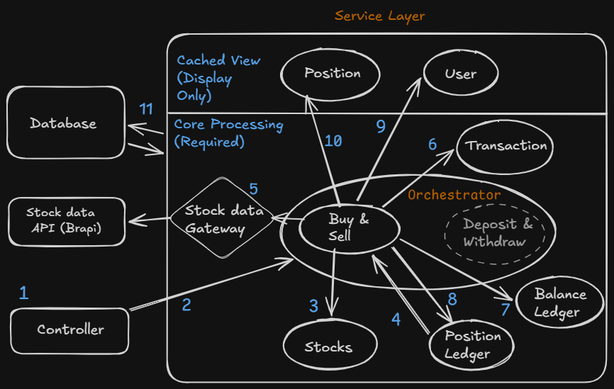
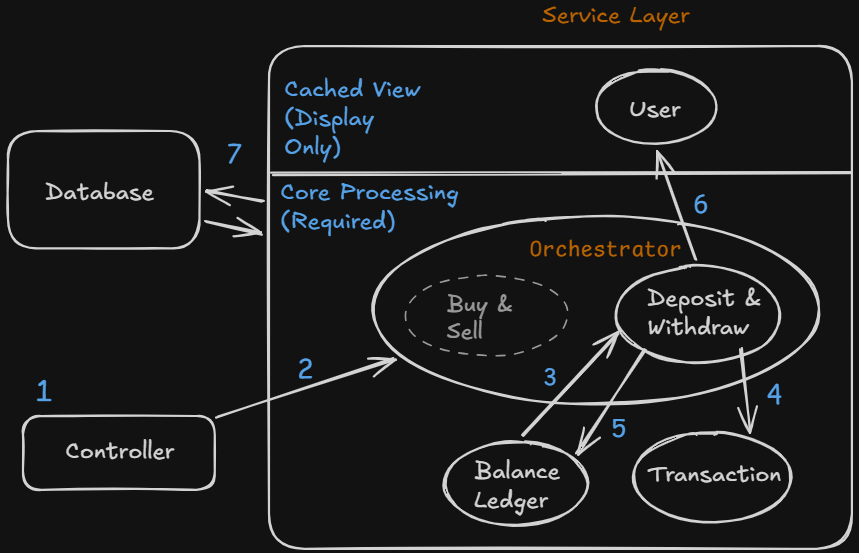
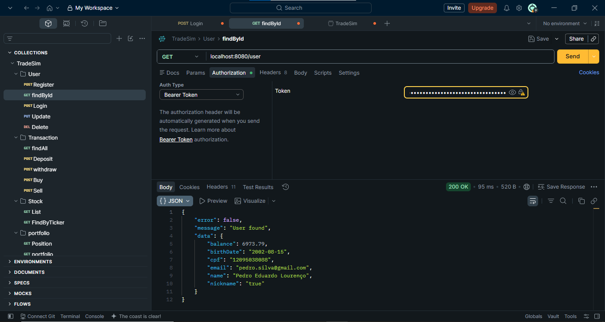
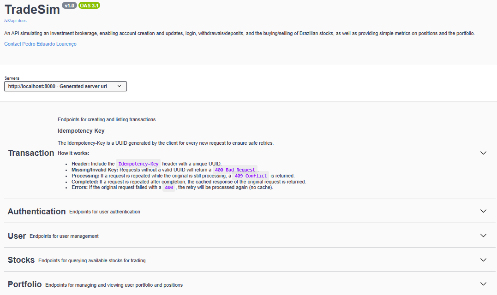

# TradeSim 📈

[](https://openjdk.org/)
[](https://spring.io/projects/spring-boot)
[](https://www.postgresql.org/)
[](https://swagger.io/)
[](https://jwt.io/)
[](https://opensource.org/licenses/MIT)

An API simulating an investment brokerage, enabling account creation, balance management, and stock trading with real-time price simulation.

This project was developed as a hands-on study to explore, practice, and implement architectural patterns, security measures, and reliability techniques commonly used in large-scale, production-ready financial systems.

---

## 📑 Table of Contents

- [Tech Stack](#-tech-stack)
- [Key Features](#-key-features)
- [Architecture & Design Decisions](#-architecture--design-decisions)
- [Security](#-security)
- [Data Modeling](#-data-modeling)
- [Documentation](#-documentation)
- [How to Run the Project](#-how-to-run-the-project)
- [Screenshots](#-screenshots)
- [Contact & Connect](#-contact--connect)
- [License](#-license)

---

## 🛠️ Tech Stack

*   **Language:** Java 21 
*   **Framework:** Spring Boot 4.0.5 (Spring Security, Spring Data JPA, Spring Validation)
*   **Database:** PostgreSQL 16 
*   **API Documentation:** Springdoc OpenAPI / Swagger UI v2.8.5
*   **External Integration:** Brapi API (for fetching real-time stock market quotes)
*   **Containerization:** Docker & Docker Compose

---

## 🚀 Key Features

*   **User Management:** Secure registration, profile updates, and active status tracking.
*   **Authentication:** Secure login using CPF (Brazilian Tax ID) and password, issuing stateless JWT tokens.
*   **Financial Operations:** Safe deposit and withdrawal endpoints with strict balance validation.
*   **Stock Trading:** Real-time stock purchasing and selling based on live market prices.
*   **Portfolio Tracking:** Real-time calculation of user positions, average purchase price, and overall portfolio performance metrics.
*   **Transaction History:** Paginated, filterable, and sortable history of all financial and stock transactions.
*   **API Idempotency:** Protection against duplicate requests on critical endpoints (deposits, withdrawals, buy, sell).

---

## 🏛️ Architecture & Design Decisions

The project is built with a focus on **maintainability, extensibility, and reliability**. Below are the core architectural decisions justified:

### 1. Layered Architecture & SOLID Principles
The codebase is organized into clean, logical layers: Controllers (Web), Services (Business Logic), Gateways (External Integrations), and Repositories (Data Access).

*   **Dependency Inversion (SOLID):** To avoid tight coupling with external stock price providers, the application communicates through the `StockDataGateway` interface. The `BrapiStockDataGateway` implements this interface. If we decide to switch from Brapi to another provider in the future, we only need to write a new implementation of the gateway without touching any core business logic in `TransactionOrchestratorService` or `StockService`.

### 2. Reliability as a Priority: The Ledger Pattern
In financial systems, relying solely on a mutable `balance` column in a database table is highly risky and prone to race conditions, synchronization issues, or untraceable state changes. 

*   **Append-Only Ledgers:** TradeSim implements `BalanceLedger` and `PositionLedger`. Every single balance movement (deposit, withdrawal, stock purchase, stock sale) and stock quantity change is recorded as an immutable ledger entry.
*   **Source of Truth:** When validating critical operations (such as checking if a user has enough balance to withdraw or buy a stock), the system calculates the user's actual balance by summing up all ledger entries (`DEBIT` and `CREDIT`). This append-only audit trail ensures absolute consistency and prevents balance tampering.

#### Diagrams of transaction processing

Transaction processing is the most complex part of the API. To illustrate how it works internally, two representative flows were diagrammed: **Sell Stock** and **Withdraw** — together they cover both ends of the processing logic.

**Legend:**

**Shapes:**
- *Squares* — architectural layers
- *Circles* — individual service classes
- *Diamonds* — gateways (external integrations)

**Core Processing vs. Cached View:** The *Core Processing* services perform the actual transaction logic and persist the source data (e.g. `Transaction`, `BalanceLedger`, and, depending on the transaction type, `Stocks` or `PositionLedger`). The *Cached View* services (`User`, and, depending on the transaction type, `Position`) are updated as a consequence, to provide an optimized, ready-to-read state for the UI — they don't drive the transaction itself. Note that `User` sits under *Cached View* only in the context of its `balance` attribute during transaction processing; it's a core service in other flows (e.g., authentication, registration).

##### 1. Sell Stock



> **Scope:** This diagram illustrates the internal processing flow of a single transaction type — **selling a stock**. It does not represent the API as a whole.

**Flow steps (Sell Stock):**
1. Request hits the `Controller`.
2. `Controller` forwards it to the orchestrator (`Buy & Sell`).
3. The `Stock` being sold is validated.
4. The user's owned quantity is checked against `PositionLedger`.
5. Current price is fetched via `Stock data Gateway`.
6. A `Transaction` record is saved.
7. A `BalanceLedger` entry is saved.
8. A `PositionLedger` entry is saved.
9. The user's cached `balance` is updated.
10. The user's cached `position`/portfolio is updated.
11. All changes are persisted atomically within a single `@Transactional` block.

##### 2. Withdraw



> **Scope:** This diagram illustrates the internal processing flow of a **withdrawal** transaction. It does not represent the API as a whole.

**Flow steps (Withdraw):**
1. Request hits the `Controller`.
2. `Controller` forwards it to the orchestrator (`Deposit & Withdraw`).
3. Available balance is checked against `BalanceLedger`.
4. A `Transaction` record is saved.
5. A `BalanceLedger` entry is saved.
6. The user's cached `balance` is updated.
7. All changes are persisted atomically within a single `@Transactional` block.

### 3. API Idempotency (Double-Spend Protection)
Network failures can cause clients to retry requests. In financial endpoints, retrying a `/withdraw` or `/buy` request could result in duplicate charges.

*   **Idempotency Keys:** TradeSim requires an `Idempotency-Key` header (containing a unique UUID) for all state-changing transactional endpoints.
*   **How it works (`IdempotencyKeyInterceptor`):**
    1.  When a request arrives, the interceptor checks if the key exists in the database for that user and path.
    2.  If the request is **already processing**, it returns `409 Conflict` to prevent concurrent duplicate executions.
    3.  If the request completed in the past — whether successfully or with an error — the interceptor intercepts the execution and returns the cached response directly from the database, avoiding re-running the business logic.
    4.  If the original request failed with a client error (400 Bad Request), the key is deleted instead of cached. This happens because results are only saved once the execution of the endpoint actually begins. When incoming parameters fail validation, the endpoint's logic never starts running, so there's no execution to associate an idempotent result with. Since no result was saved, the key is removed, allowing the client to correct the payload and retry safely.

### 4. High-Precision Monetary Values
Floating-point numbers (`float`, `double`) are inherently imprecise and must never be used for financial calculations due to rounding errors. TradeSim strictly uses Java's `BigDecimal` with a scale of 4 decimal places and `RoundingMode.HALF_EVEN` (banker's rounding) for all prices, fees, and balances.

---

## 🔒 Security

The application implements a stateless authentication flow with targeted protection against common data-exposure vulnerabilities:

*   **Spring Security & JWT:** Authentication is stateless. Upon a successful login with CPF and password, a JWT token is generated containing the user's ID and an expiration time (1 hour). Subsequent requests must include this token in the `Authorization: Bearer <token>` header.
*   **IDOR (Insecure Direct Object Reference) Protection:** To prevent malicious users from guessing UUIDs and accessing other users' private data, the `IDORFilter` intercepts incoming requests (such as `/positions/{id}`). It verifies if the requested resource actually belongs to the authenticated user. If not, it immediately rejects the request with a `403 Forbidden` status before it even reaches the controller.

---

## 📊 Data Modeling

The database schema consists of the following core entities:

*   **User:** Stores profile information, encrypted passwords, and a cached balance.
*   **Stock:** Represents a tradeable asset on the platform (e.g., PETR4, VALE3).
*   **Transaction:** Acts as a historical log of all user actions (DEPOSIT, WITHDRAW, STOCK_BUY, STOCK_SELL), recording quantities, prices, and fees.
*   **BalanceLedger:** Immutable ledger entries tracking financial debits and credits.
*   **PositionLedger:** Immutable ledger entries tracking stock quantity changes (BUY, SELL).
*   **Position:** Represents the aggregated current holding of a specific stock by a user.
*   **IdempotencyKey:** Stores the status, expiration, and cached response of idempotent requests.

---

## 📖 Documentation

You can access the API documentation in two ways:

1. **Online (Static):** View the full documentation anytime, without running the server — just open the link: [Documentation](https://pedrolourenco18.github.io/TradeSim/)
2.  **Swagger UI (Live):** Prefer the interactive version? Start the server and explore the endpoints directly in your browser. Check the [How to Run the Project](#-how-to-run-the-project) section to get it running.

---  

## 🐳 How to Run the Project

The easiest way to run the application is using **Docker Compose**, which spins up the Spring Boot application, a PostgreSQL database, and pgAdmin for database management.

### Prerequisites
*   Docker and Docker Compose installed.
*   A `.env` file in the root directory with the following variables:
    ```env
    DB_HOST=postgres
    DB_PORT=5432
    DB_NAME=tradesim
    DB_USERNAME=postgres
    DB_PASSWORD=your_secure_password
    APP_PORT=8080
    PGADMIN_EMAIL=admin@admin.com
    PGADMIN_PASSWORD=admin
    ```

### Steps to Run
1.  Clone the repository:
    ```bash
    git clone https://github.com/PedroLourenco18/TradeSim.git
    cd TradeSim
    ```
2.  Start the services:
    ```bash
    docker-compose up --build -d
    ```
3.  The API will be available at: `http://localhost:8080`
4.  Access the interactive Swagger API documentation at:
    `http://localhost:8080/swagger-ui/index.html`
5.  Access pgAdmin at: `http://localhost:5050`

---

## 📸 Screenshots

Here are some visual highlights of the application:

### Postman


### Swagger Documentation


---

## 📬 Contact & Connect

*   **Developer:** Pedro Eduardo Lourenço
*   **Email:** pedroedu2007@gmail.com
*   **LinkedIn:** [/in/pedroelourenço/](https://www.linkedin.com/in/pedroelourenço/)

---

## 📄 License

This project is licensed under the MIT License - see the [LICENSE](LICENSE.md) file for details.
